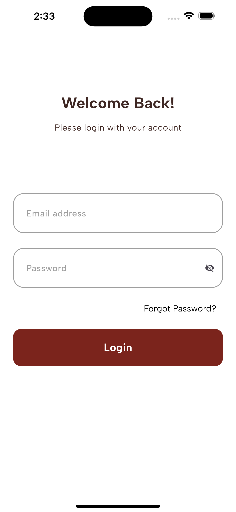
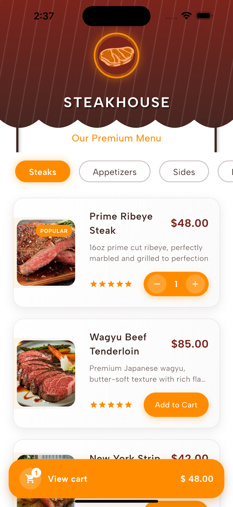
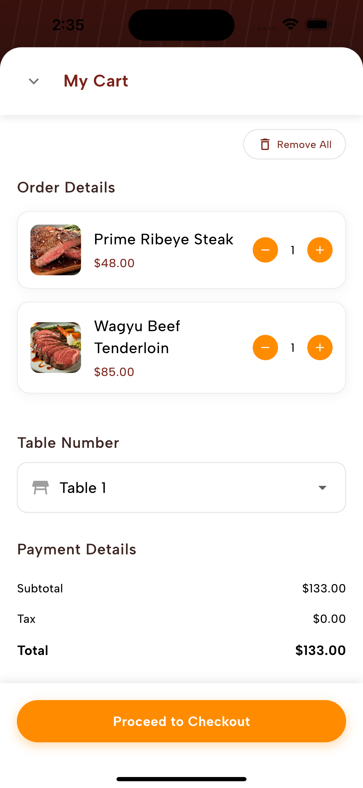
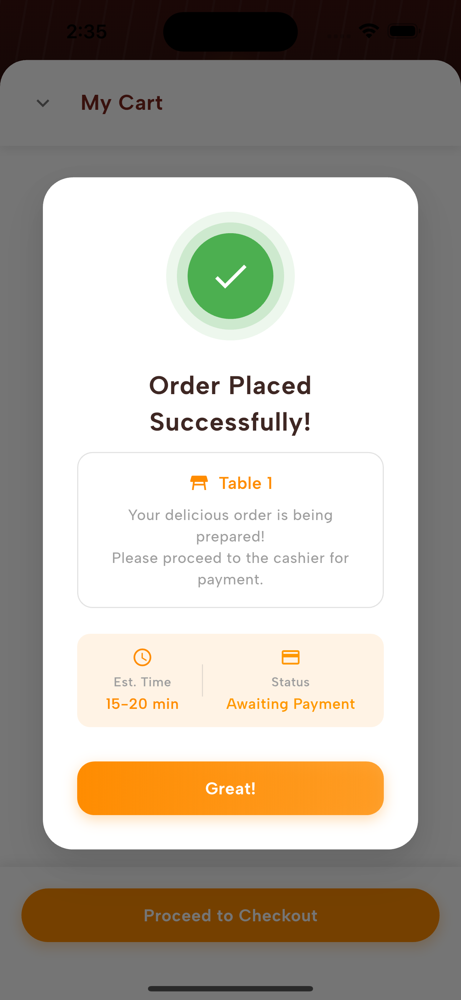

# 🍽️ Restaurant App

A modern Flutter restaurant application that allows customers to browse menus, add items to cart, and place orders with table number integration. The app provides a seamless dining experience where customers can order from their table and pay at the cashier.

## 📱 Screenshots

| Login Screen | Menu Screen | Cart Screen | Order Confirmation |
|:---:|:---:|:---:|:---:|
|  |  |  |  |

## 🎥 Demo Video

[[Demo video]](https://drive.google.com/file/d/1ZOG9XglGnjzWfcu6tqnHCD5sh-4U5S8E/view?usp=drivesdk)

## ✨ Features

- 🔐 **Firebase Authentication** - Secure user login and registration
- 🎨 **Native Splash Screen** - Custom branded splash screen
- 📱 **Responsive Design** - Optimized for all screen sizes using ScreenUtil
- 🍕 **Static Menu Display** - Browse restaurant menu items
- 🛒 **Add to Cart** - Add/remove items with Firebase Firestore integration
- 📊 **Real-time Cart Management** - Live cart updates with BLoC state management
- 🏪 **Table Number Integration** - Orders include table number for easy service
- 💰 **Cashier Payment Flow** - Complete orders and pay at cashier
- ⏳ **Loading Animations** - Smooth loading states with animated widgets
- 🎨 **Google Fonts** - Beautiful typography throughout the app
- 🌟 **Lottie Animations** - Engaging micro-interactions

## 🛠️ Tech Stack

### State Management
- **flutter_bloc** `^9.1.1` - Predictable state management

### Backend & Database
- **Firebase Core** `^3.15.2` - Firebase SDK
- **Firebase Auth** `^5.7.0` - User authentication
- **Cloud Firestore** `^5.6.12` - NoSQL database for cart and orders

### UI/UX
- **flutter_screenutil** `^5.9.3` - Responsive design
- **google_fonts** `^6.2.1` - Typography
- **cupertino_icons** `^1.0.8` - iOS-style icons
- **loading_animation_widget** `^1.3.0` - Loading animations
- **flutter_native_splash** `^2.4.6` - Native splash screen

## 📁 Project Structure

```
lib/
├── core/
│   ├── components/          # Reusable UI components
│   ├── constants/           # App constants
│   │   └── constants.dart
│   └── helpers/
│       ├── app_regex.dart   # Regular expressions
│       └── navigation.dart  # Navigation helper
├── features/
│   ├── cart_screen/
│   │   ├── data/           # Cart data layer
│   │   └── widgets/        # Cart-specific widgets
│   │       └── cart_screen.dart
│   ├── login_screen/       # Authentication feature
│   └── menu_screen/        # Menu browsing feature
├── routes/
│   ├── app_router.dart     # App routing configuration
│   └── routes.dart         # Route definitions
├── themes/
│   ├── color_manager.dart  # Color palette
│   └── text_styles.dart    # Typography styles
├── widgets/
│   ├── app_text_button.dart      # Custom text button
│   └── app_text_form_field.dart  # Custom form field
├── firebase_options.dart   # Firebase configuration
└── main.dart              # App entry point
```


## 🏗️ Architecture

This app follows **Clean Architecture** principles with **BLoC** pattern:

- **Presentation Layer**: UI components and BLoC
- **Domain Layer**: Business logic and entities  
- **Data Layer**: Firebase integration and repositories


## 📚 Key Packages Explained

| Package | Purpose | Usage |
|---------|---------|-------|
| `flutter_bloc` | State management | Managing app state and business logic |
| `firebase_auth` | Authentication | User login/register functionality |
| `cloud_firestore` | Database | Storing cart items and orders |
| `flutter_screenutil` | Responsive design | Adapting UI to different screen sizes |
| `google_fonts` | Typography | Custom fonts throughout the app |
| `loading_animation_widget` | Loading states | Animated loading indicators |
| `lottie` | Animations | Vector animations for better UX |
| `flutter_native_splash` | Splash screen | Native splash screen generation |


## 👨‍💻 Author

**Anas Nasr**
- GitHub: [@AnasNasr-afk](https://github.com/AnasNasr-afk)
- Email: anas.nasr132003@gmail.com
